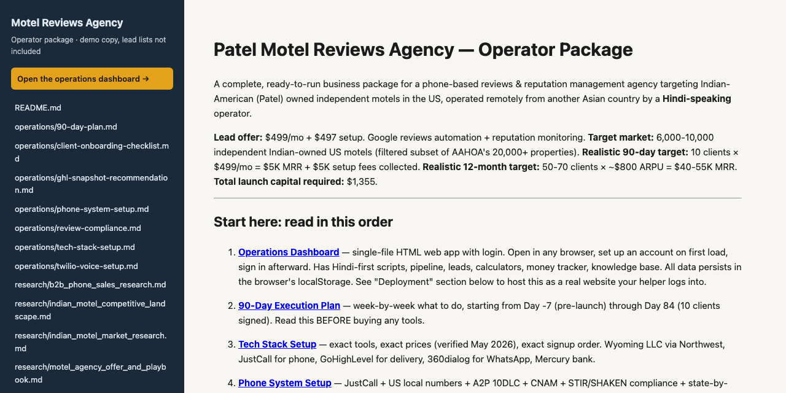

# Patel Motel Reviews Agency — Operator Package

 

A complete, ready-to-run business package for a phone-based reviews & reputation management agency targeting Indian-American (Patel) owned independent motels in the US, operated remotely from another Asian country by a **Hindi-speaking** operator.

**Lead offer:** $499/mo + $497 setup. Google reviews automation + reputation monitoring.
**Target market:** 6,000-10,000 independent Indian-owned US motels (filtered subset of AAHOA's 20,000+ properties).
**Realistic 90-day target:** 10 clients × $499/mo = $5K MRR + $5K setup fees collected.
**Realistic 12-month target:** 50-70 clients × ~$800 ARPU = $40-55K MRR.
**Total launch capital required:** $1,355.

---

## Start here: read in this order

1. **[Operations Dashboard](dashboard.html)** — single-file HTML web app with login. Open in any browser, set up an account on first load, sign in afterward. Has Hindi-first scripts, pipeline, leads, calculators, money tracker, knowledge base. All data persists in the browser's localStorage. See "Deployment" section below to host this as a real website your helper logs into.

2. **[90-Day Execution Plan](operations/90-day-plan.md)** — week-by-week what to do, starting from Day -7 (pre-launch) through Day 84 (10 clients signed). Read this BEFORE buying any tools.

3. **[Tech Stack Setup](operations/tech-stack-setup.md)** — exact tools, exact prices (verified May 2026), exact signup order. Wyoming LLC via Northwest, JustCall for phone, GoHighLevel for delivery, 360dialog for WhatsApp, Mercury bank.

4. **[Phone System Setup](operations/phone-system-setup.md)** — JustCall + US local numbers + A2P 10DLC + CNAM + STIR/SHAKEN compliance + state-by-state recording laws. Everything needed to call US motels legally from India.

5. **[Sales Playbook](scripts/sales-playbook.md)** — cold-call script (Gujarati/Hindi/English), top 10 objections + responses, WhatsApp Day-0 through Day-30 sequence, discovery call structure, MSA template, onboarding flow, voicemail scripts, referral request scripts.

---

## What's in this package

### Operational
- [dashboard.html](dashboard.html) — operator dashboard with login, daily checklist, pipeline, leads, Hindi-first scripts, calculators, money tracker
- [operations/90-day-plan.md](operations/90-day-plan.md) — execution plan with weekly targets
- [operations/tech-stack-setup.md](operations/tech-stack-setup.md) — complete software stack walkthrough
- [operations/phone-system-setup.md](operations/phone-system-setup.md) — VoIP + SMS + WhatsApp setup from India
- [operations/client-onboarding-checklist.md](operations/client-onboarding-checklist.md) — bulletproof Day 0 → Day 7 onboarding playbook with Hindi WhatsApp templates
- [operations/review-compliance.md](operations/review-compliance.md) — **⚠️ critical** — Google 2026 policy + FTC rule + soft-routing form copy
- [operations/ghl-snapshot-recommendation.md](operations/ghl-snapshot-recommendation.md) — buy LeadsFlex $197 snapshot, override the default rating-gate, custom-build SMS workflows

### Sales materials
- [scripts/sales-playbook.md](scripts/sales-playbook.md) — full script library (⚠️ pre-compliance update — see dashboard for canonical scripts)

### Background research (read once for context, refer to as needed)
- [research/indian_motel_market_research.md](research/indian_motel_market_research.md) — market sizing, pain points, AAHOA data, risks
- [research/indian_motel_competitive_landscape.md](research/indian_motel_competitive_landscape.md) — existing vendors, pricing benchmarks, whitespace map
- [research/motel_agency_offer_and_playbook.md](research/motel_agency_offer_and_playbook.md) — why reviews specifically, ROI math
- [research/b2b_phone_sales_research.md](research/b2b_phone_sales_research.md) — broader B2B phone-sales market analysis (the original research that led here)

---

## The thesis in one paragraph

US independent motels are ~60% Indian-American owned, most Patel family-operated. Their #1 distribution channel (OTAs like Booking.com / Expedia) ranks them by Google rating. A 1-star rating gap = ~11% ADR uplift per Cornell research = $50K-$60K/yr in lost revenue for a typical 30-room property. **Zero competitors publicly market reviews/reputation services to this niche in Hindi.** A native Hindi-speaking operator can close in 1 call instead of 5, leveraging trust and community referrals that no English-only agency can replicate. The Patel cousin network compounds — every signed client refers 3-5 cousins. Window is open for next 24-36 months before 2nd-gen Indian-American agencies arbitrage it away.

---

## What's NOT in this package (and why)

- **A custom-built SaaS** — GoHighLevel does everything the operator needs at $297/mo. Building proprietary software would burn 6 months and $50K for no advantage.
- **Mass cold email infrastructure** — phone-first is the wedge. Cold email is week-10+ as a secondary channel.
- **Hotel PMS / channel manager** — those categories are crowded (Cloudbeds, SiteMinder, eZee). We refer; we don't compete.
- **AI cold calling (Air.ai-style)** — banned in this niche. Patel motel owners hate AI cold calls; also live class-action TCPA risk.
- **Rating-gating (4-5 → Google, 1-3 → private)** — banned by Google's April 2026 policy and FTC Consumer Review Rule. $53,088/violation. **The dashboard scripts and onboarding checklist have been updated to soft-routing instead.** Every GHL snapshot on the market still ships with the illegal version as default — overriding it is the first deliverable for every new client.
- **Fake reviews / black-hat tactics** — kills the agency and the client's listing. Never do this.

---

## Critical risks and mitigations

| Risk | Likelihood | Mitigation |
|---|---|---|
| 1st-gen Patel owners aging out → 2nd-gen English-fluent kids modernize themselves | High over 5-10 yrs | Capture clients NOW; design for 36-month window; transition to bilingual delivery as 2nd-gen takes over |
| Independent motel segment in structural decline | Medium | Products that HELP owners survive (reviews → direct bookings → less OTA dependency) sell BETTER in contracting markets |
| AAHOA member fatigue from 400+ existing vendors | Medium | Be the rare Gujarati-speaking voice — cuts through the English-only noise |
| Stripe account held (new LLC, India founder) | Medium | Submit clean docs day 1; Wise Business as backup |
| A2P 10DLC rejection | Low-Medium | Clean sample messages, proper LLC docs, persistent resubmission |
| TCPA litigation | Low for B2B landlines | Scrub National DNC for cells; announce recording in 13 two-party states; respect 8am-9pm local-time rule |
| Single dependency on operator language skills | Medium | Plan for hiring 2-3 bilingual Indian dialers by Month 2 to scale |

---

## Deployment — host the dashboard as a real website

The dashboard is a single self-contained HTML file. To turn it into a website your helper logs into from anywhere, host it on any static host. All free, all take under 5 minutes:

### Option A — Netlify Drop (easiest, 2 min)
1. Go to [app.netlify.com/drop](https://app.netlify.com/drop)
2. Drag `dashboard.html` into the browser window
3. Netlify gives you a URL like `https://wonderful-tesla-123abc.netlify.app`
4. (Optional) Claim the site to a free account → add a custom domain like `dashboard.youragency.com`
5. Share the URL + login credentials with your helper

### Option B — Vercel (CLI, 3 min)
1. Install Vercel CLI: `npm i -g vercel`
2. From the `motel-agency/` folder: `vercel`
3. Follow prompts → deployed in 30 seconds
4. Custom domain via Vercel dashboard if you want

### Option C — Cloudflare Pages (best for production, free SSL + DDoS protection)
1. Push the `motel-agency/` folder to a GitHub repo
2. Connect at [pages.cloudflare.com](https://pages.cloudflare.com) → "Create a project" → select the repo
3. Build command: leave blank. Output directory: `/`
4. Deploy → free subdomain `youragency.pages.dev` + can add custom domain

### Option D — Your own domain
- Buy a domain at [Namecheap](https://www.namecheap.com) or [Cloudflare](https://www.cloudflare.com/products/registrar/) — $10-12/yr
- Point it at any of the above hosts via DNS

### Important notes on the login system
- **Data lives in the browser's localStorage** — meaning each device the helper logs in from will have its own data. There is no central server.
- This is intentional for v1: zero server costs, zero database to manage, zero security exposure to leaked credentials.
- For the helper to work from multiple devices, they should **use ONE device consistently** (e.g., their work laptop) and use the Export/Import feature in Settings to backup regularly.
- If you outgrow this and need real multi-device sync, that's a v2 conversation — would require a backend (Node + Postgres + Auth) and ~2 weeks of build time.

### Sharing the login with your helper
After hosting:
1. You access the URL first, complete the first-run setup (set agency name, your helper's name, their email, a password)
2. Share with your helper: **URL + email + password**
3. They log in → see everything ready to go
4. They can change their own password from Settings → Change password

---

## Recommended cadence after launch

- **Daily:** Open dashboard, run morning warm-up, 3 call blocks, WhatsApp follow-ups, log everything, plan tomorrow
- **Weekly Sunday:** Review pipeline, plan next week's list, pay dialer commissions
- **Monthly 1st:** Auto-charge MRR, send monthly reports to all clients, calibration calls with each
- **Quarterly:** Review pricing (raise it $50/mo for new clients after every 10 signed), audit tech stack, review market position

---

## Support and updates

This package is opinionated and version-1. Things that should be revisited every 60 days:
- Pricing tier — does $499 still match the value being delivered, or should it move to $599?
- Tech stack — are tool prices still as quoted? GHL or JustCall changes pricing 1-2x per year
- Pain points — has anything shifted in AAHOA owner concerns (new TVPRA enforcement, OTA commission changes, etc.)
- Competitive — has any 2nd-gen Indian-American agency entered the niche in Hindi/Gujarati?

---

## Bottom line

This is a **$30-50K/mo lifestyle business** opportunity for a Hindi/Gujarati-speaking operator with average-to-good phone skills and the willingness to work US business hours from Asia for 3 months until the team is trained. **It is not a unicorn.** It is a real, sustainable, recession-resistant income business with a defensible language moat.

If the operator follows the 90-day plan exactly:
- Week 12: $5K MRR + $5K cumulative setup = $10K in the bank
- Month 6: $20-25K MRR
- Month 12: $40-55K MRR

That's the entire deal. Now go make the first call.

---

*Package built May 2026 — opus 4.7 (1M context).*
*All research and pricing verified at the time of build. Refresh quarterly.*

---

**If this is useful to you, a ⭐ on the repo helps other people find it.** Issues and pull requests are welcome.

Built by [Priyankar "Sunny" Chakraborty](https://github.com/suncal) · [everbuiltstudio.com](https://everbuiltstudio.com)
